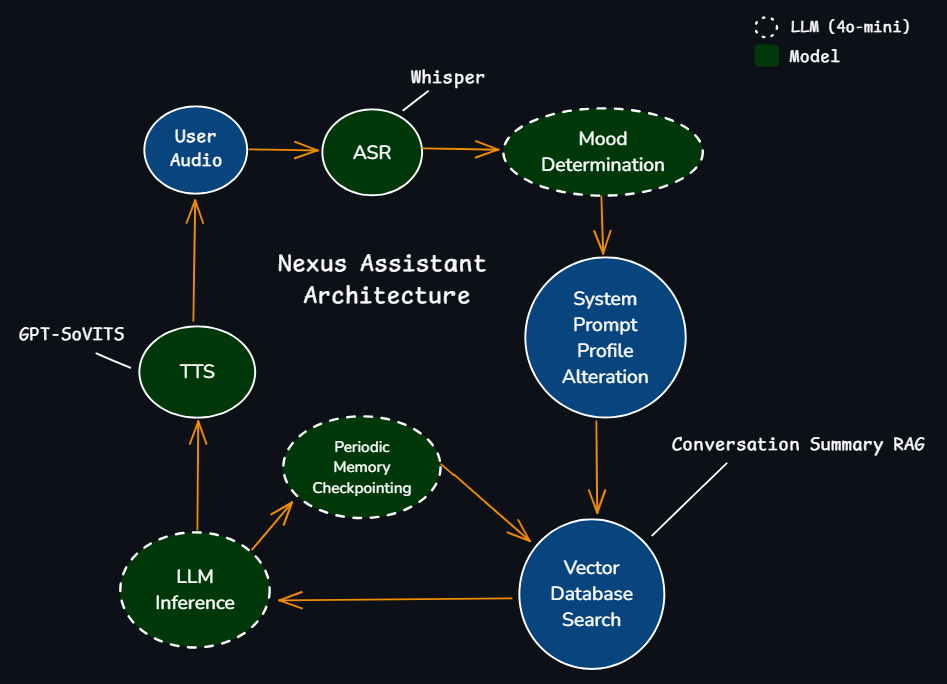

# **Nexus Assistant**
Nexus Assistant is an advanced AI-powered voice assistant that dynamically adjusts its personality and responses based on user interactions. It leverages speech recognition (ASR), large language models (LLMs), emotion-aware profiling, and temporally-aware retrieval-augmented generation (RAG) to create a highly interactive and emotionally adaptive conversational AI.  
  
Using OpenAI’s Whisper for speech recognition, GPT-SoVITS for voice synthesis, and FAISS-based RAG for memory recall, Nexus Assistant enables fluid, contextually relevant, and emotionally engaging conversations in real-time.




---

## **Features**
✔ **Automatic Speech Recognition (ASR)** – Converts user speech into text for processing utilizing OpenAI's Whisper.  
  
✔ **Emotion-Adaptive Responses** – Determines the emotional context of conversation topic utilizing a secondary LLM (GPT-4o-mini) and adjusts its responses accordingly using preset mood system prompt profiles. 
  
✔ **Temporal-Aware Retrieval-Augmented Generation (RAG)** – The conversation is summarized and timestamped every six messages or upon close. This summary is saved in a FAISS Index and then retrieved as context when relevant. The Dateparser library is utilized to resolve natural language dates to absolute dates to aid in retrieval accuracy.  
- Ex. "What did I have for dinner yesterday?" --> "What did I have for dinner yesterday? [Time: 2025-03-02 19:16:24]"
  
✔ **Voice Synthesis (TTS)** – Utilizing GPT-SoVITS Assistant responses are converted to speech, audio fragments are streamed to the user for faster-response time.  

---

---
## Setup
1. Clone the Repo:
```
git clone https://github.com/ncoffey42/Nexus_Assistant
```
2. Setup the Conda environment
```
conda env create -f nexus_environment.yml
conda activate nexus_assistant
```
3. Configure Environment Variables:
Create a .env file in the project root directory and add your OpenAI API key:
```
OPENAI_API_KEY=yourkey
```
4. Follow Instructions to download GPT-SoVITS:
   https://github.com/RVC-Boss/GPT-SoVITS  
5. Configure your GPT-SoVITS Voice-pack and adjust pathing in nexus_assistant.py line 390:  
``` with open("GPT_SoVITS/configs/YourVoicePack.yaml", "r") as f:```  
6. Run your Nexus Assistant:
```python nexus_assistant.py```

---

## Special thanks to:
Jarod Mica for his work used as a basis for streaming GPT-SoVITS audio fragments. https://github.com/JarodMica/open-neruosama/tree/master


